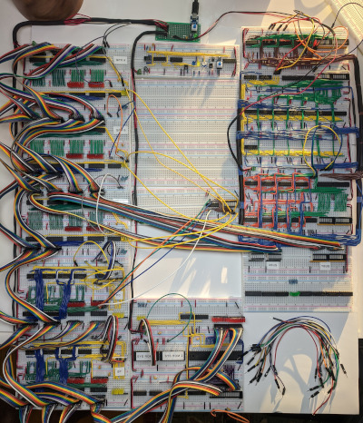
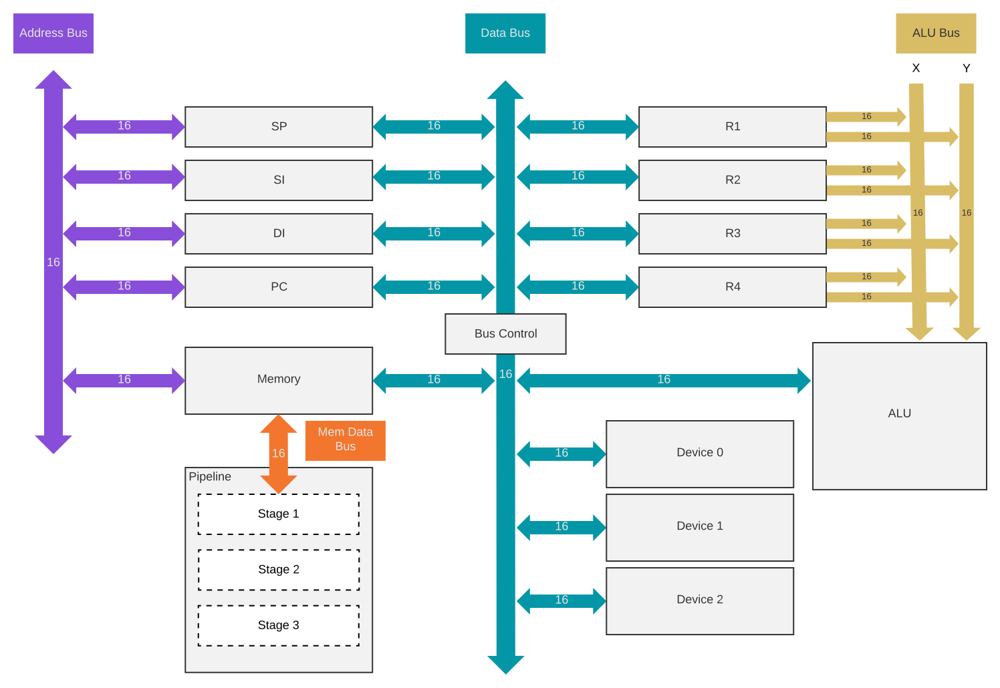
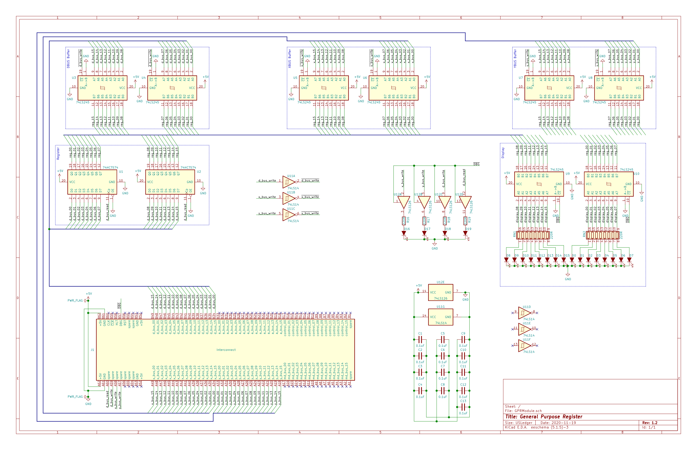

# uCPU

This is a 16bit pipelined CPU designed on a breadboard and produced in modular component boards.

My objective in this project is to learn electronics, CPU design and build a fully functional CPU that can be updated, added to and further developed easily.

The CPU is designed around
* four general purpose 16 bit registers
* four 16 bit address registers
* ALU supporting addition, subtraction, shift and bitwise operations
* piplined instructions
* banked memory with a base of 64k, expandable to about 1.5 megabytes (max TBD)

## Architecture

## GPR

The CPU supports up to four registers: A, B, C and D. Each register has identical functionality. The registers hold 16 bit values and individual bytes are not accessible, only the full 16 bit value.

Each register has access to multiple busses in the CPU. 16 bit values may be read from the general data bus (d_bus_read) and correspondingly 16 bit values may be written (d_bus_write) to the data bus. Additionally, general purpose registers may write 16 bit values to ALU via the X (x_bus_write) and Y (y_bus_write) bus. Values may not be read from the X and Y bus by the general purpose registers.

Four control signals control the operation of the general purpose register.

* d_bus_read - Read the contents of the data bus into the register latch
  * Active high
* d_bus_write - Write the contents of the register latch onto the data bus
  * Active low
* x_bus_write - Write the contents of the register latch onto the X bus to be used by the ALU
  * Active low
* y_bus_write - Write the contents of the register latch onto the Y bus to be used by the ALU
  * Active low
